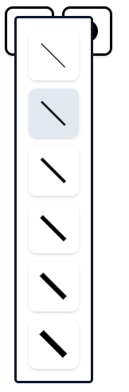
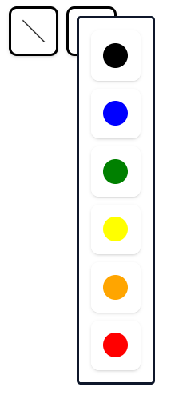
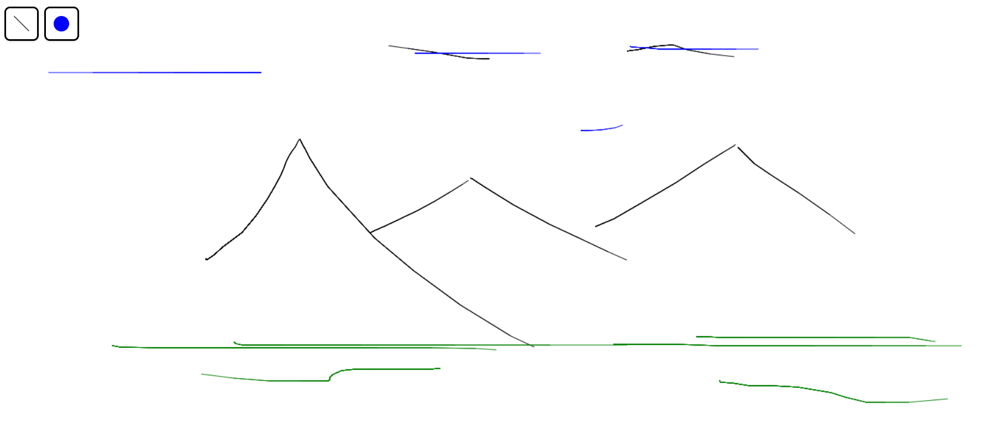

#  Oodle

Welcome to **Doodle**! A playful and intuitive drawing and doodling application. Built with 💻 **React Hooks** and the **Canvas API**, this project was a delightful way for me to explore the world of interactive art tools.

---

## 🚀 Features at a Glance  
- **Tool Customization**: Choose your favorite brush size and colors.  
- **Intuitive controls**: Effortlessly undo/redo your strokes using:  
  - `Ctrl + Z` → Undo  
  - `Ctrl + Y` → Redo  

---

## 🛠️ How It Works  

### 1️⃣ **Choose Your Tools**  
Get ready to create by selecting your desired brush size and color!  

  

---

### 2️⃣ **Start Doodling**  
Let your imagination run wild! Draw, scribble, or create masterpieces right on the canvas.  

  

---

## 💡 Why I Built This  
This project was my playground to:  
- Master the **Canvas API** for drawing and rendering graphics.  
- Deepen my understanding of **React Hooks** for state management and effects.  
- Have fun creating something creative and functional!  

---

### 🖌️ Ready to Doodle?  
Clone the repository and start doodling. Feedback and suggestions are always welcome! 😊  
